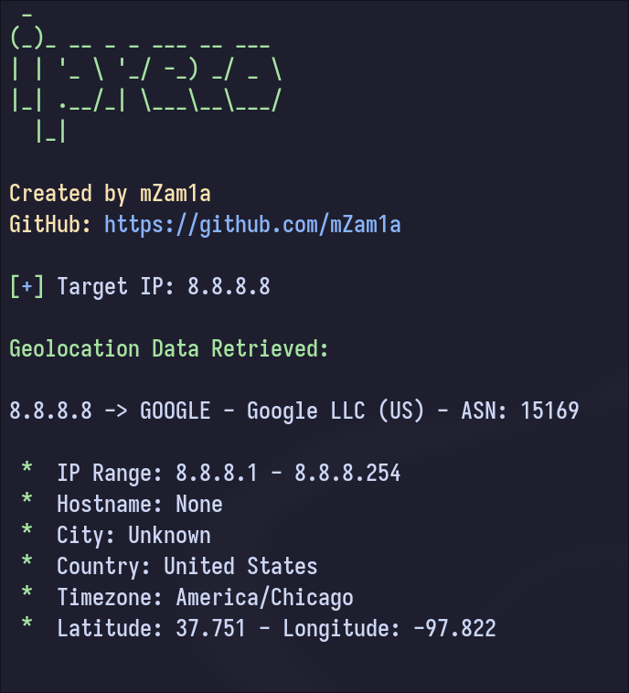

# Ipreco - Simple ip info data with python

This program is a simple Python script that retrieves information about an IP address using the ip.guide API.

This tool is for educational purposes. I am not responsible for any misuse of this tool. Use it at your own risk.

***

**Requirements:**
- Python 3
- requests module: 

    `pip install requests`

**Installation:**
Download the repository and run the script using Python.

    git clone https://github.com/mZam1a/ipreco.git

**Sample Usage:**

    python ipreco.py -h #Show help

You can get your own IP information.

    python ipreco.py #Get info about your own IP

Or an specific IP address.

    python ipreco.py <ip> #Get info about a specific IP address

And you can also apply DNS resolution to the target IP.

    python ipreco.py -d #Apply DNS resolution to the target IP

That's all! Enjoy it! ;)